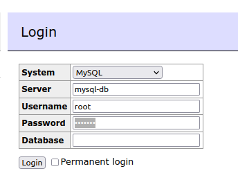

# Savings dashboard

Installing Airflow:
```shell
AIRFLOW_VERSION=2.1.2
PYTHON_VERSION="$(python --version | cut -d " " -f 2 | cut -d "." -f 1-2)"
# For example: 3.6
CONSTRAINT_URL="https://raw.githubusercontent.com/apache/airflow/constraints-${AIRFLOW_VERSION}/constraints-no-providers-${PYTHON_VERSION}.txt"
# For example: https://raw.githubusercontent.com/apache/airflow/constraints-no-providers-2.1.2/constraints-3.6.txt
pip install "apache-airflow==${AIRFLOW_VERSION}" --constraint "${CONSTRAINT_URL}"
```

# Development

Virtual environment:
```shell
. ./deployment/start_venv.sh
```

Deploy DAG:
```shell
./deployment/deploy_dag.sh
```



Łączenie się z bazą:
```python
import mysql.connector
cnx = mysql.connector.connect(user="root", password="example", host="localhost", database="my_test_database")
```

Baza MySQL:
```shell
docker-compose -f deployment/target-database-stack.yml up
```